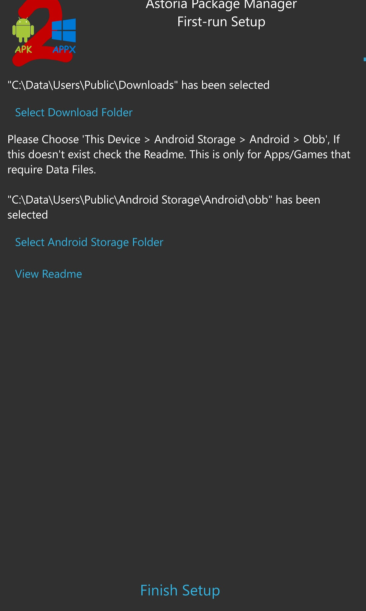
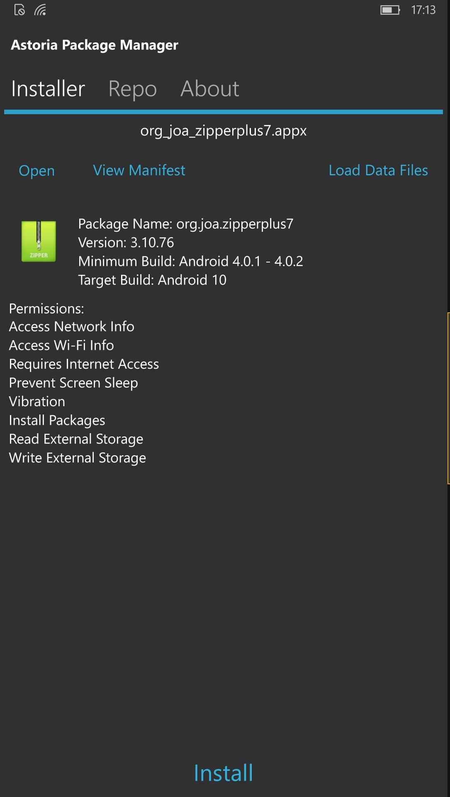
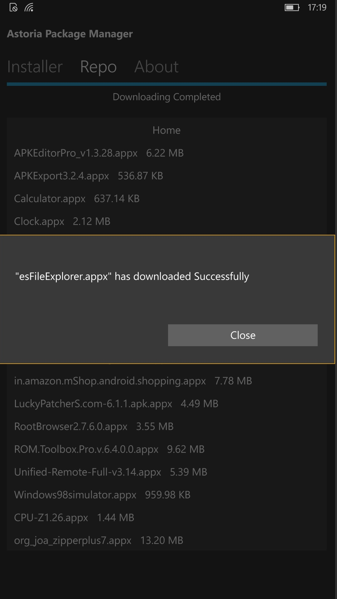
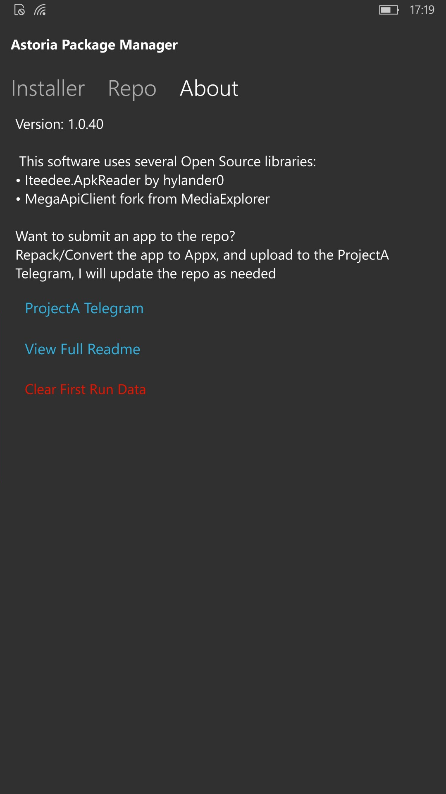

# Astoria Package Manager (AstoriaPMan)
Great RnD project by Empyreal96. I forked it for learning some apk / uwp "preparations/transformations" algorythms. 

## About the original

A simple Package Manager for Windows Phones running Astoria builds (10240 - 10570) 

# Design / Screenshots
<table><tr>
<td>  </td>
<td>  </td>
<td>  </td>
<td>  </td>
</tr></table>

## My 2 cents
- Minimal code refactoring (a lot of line breaks only)

## Requirements:

- Windows 10 Mobile Builds 10240 - 10570
- Access to Android Storage: `This Device > Android Storage > Android > obb`
  - Either from [WindOS Fone Guide](https://youtu.be/vP-z8jVXVBQ)
  - Manually create the Folder Junction (See FAQ)
- [Apk2Appx](https://github.com/fadilfadz01/Apk2Appx_Converter) Converted Apps

## Features:
- Install Apk2Appx converted apps.
- Copy App Data to Android Storage
- View Package Info (Permissions, API Targets etc).
- Browse the ProjectA Repo to download Games and Apps!

# Help/FAQ

**How do I access Android Storage? I don't have [This Phone] > [Android Storage] folder**

You have two options to restore the folder:

- Re-apply "Patch 2" from the [WindOS Fone Guide](https://youtu.be/vP-z8jVXVBQ)
- Manually create the folder, You will need [CMD access](https://github.com/fadilfadz01/CMD.Injector) on-device.  

To manually create, open/connect to the Command Prompt, and type:

`mklink /J "C:\Data\Users\Public\Android Storage" "C:\Data\Users\DefApps\AppData\Local\aow\mnt\shell\emulated\0\" `

### Notices from the author:
- UI is not final 
- This is still in early stages, issues may occur.

## References
- https://github.com/Empyreal96/Astoria-Package-Manager
- https://github.com/Empyreal96/

## ..
As-is.

- m.e. 2022
